# Jenkins

### 概念

[持续集成等相关概念](https://www.zhihu.com/question/23444990)

[Jenkins原理](http://www.cnblogs.com/liyuanhong/p/6548925.html)

### 环境

Mac jdk1.8 Jenkins LTS

### 安装

去Jenkins[官网](https://jenkins.io/)下载相对应自己的Jenkins版本，建议使用LTS版本，下载好之后命令行进入该目录，使用命令：

```shell
java -jar yourpath/jenkins.war
```

启动Jenkins。此时在当前用户下的目录会生成一个.jenkins即～/.jenkins注意终端中的一个信息：

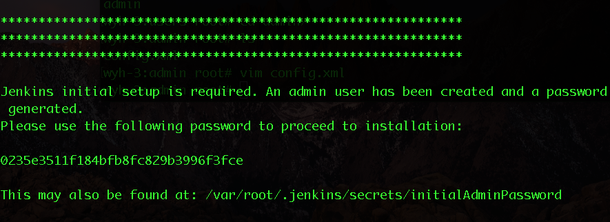

这个是第一次登陆Jenkins的密码，如果想要先使用匿名用户登录的话，在.jenkins下会有一个config.xml文件，把userSecurity改成false就好了。此时访问localhost:8080第一次登陆的话用户名是admin，密码就是上面图片里面的那个一串，登录之后会让你选择安装模式：

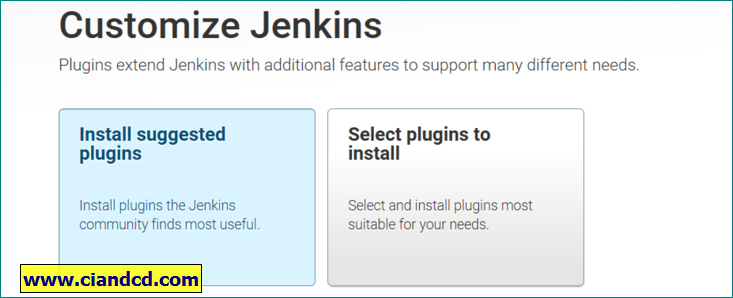

选择install suggested plugins这个选项，等待安装

安装成功之后需要创建一个用户

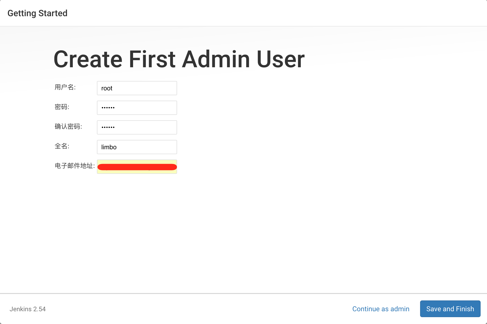

创建结束后提示

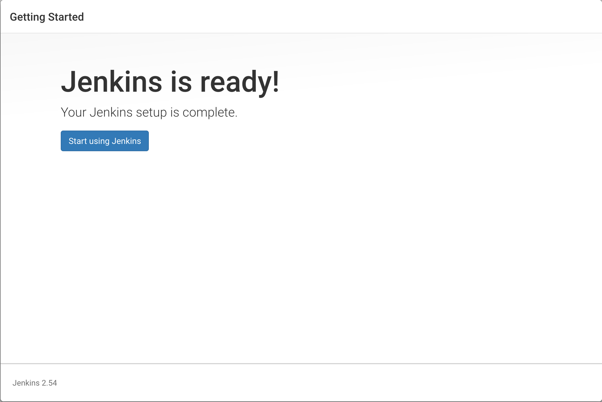

点击按钮进入dashboard，此时要输入刚刚创建的用户名密码登录，进入dashboard：

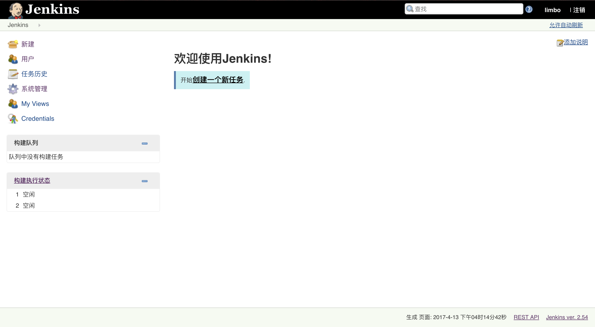

至此，Jenkins安装完成

### 使用

点击创建一个新任务,填入名字，选择构建一个自由风格的软件项目：

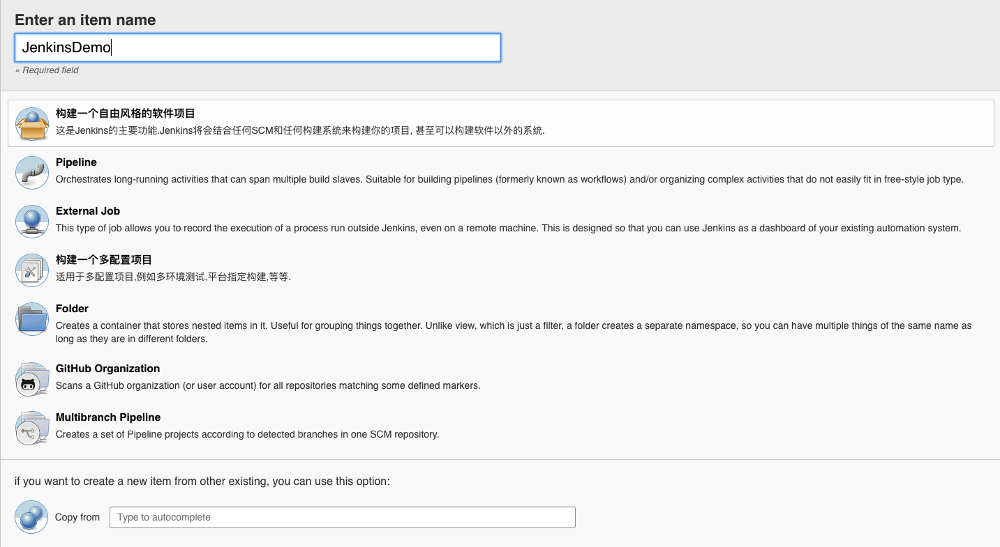

选择ok继续

#### General

General不需要更改

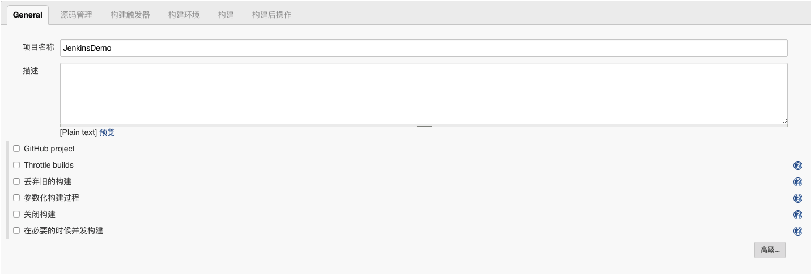

#### 源码管理

源码管理这里选择使用git

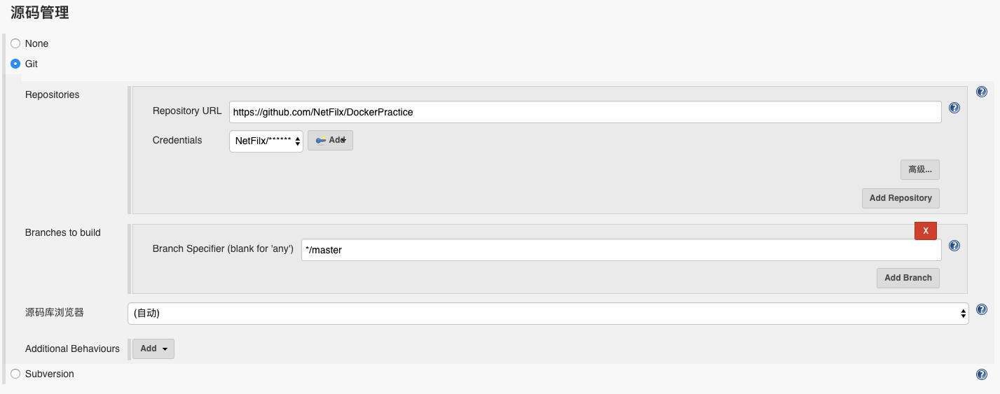

填入需要持续集成的git repo，注意需要添加Credentials，并切换成你刚刚填入的Credentials

#### 构建触发器

构建触发器是一个重要的配置，因为需要设置触发器，才可以知道什么时候需要将更新进行发布，这里选择使用GitHub hook trigger for GITScm polling，这个选项表示，当github上代码出现变动的时候就更新。

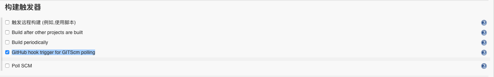

这里把选项选上，然后需要去github下，在settings里面选择integrations&services

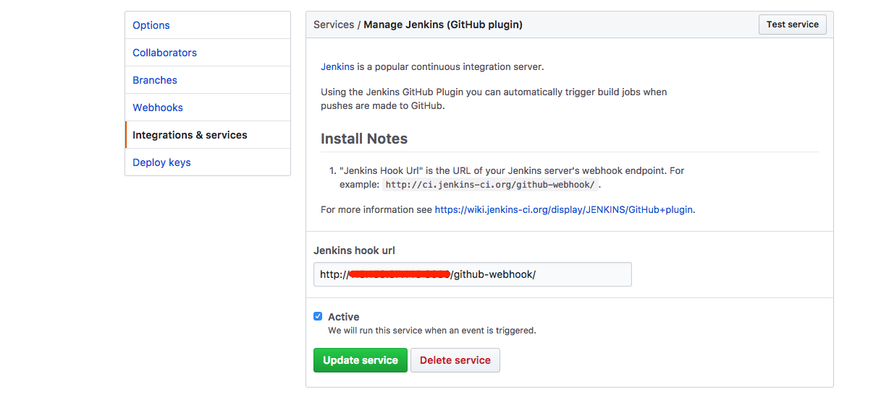

在那个Jenkins hook url里面填写你的Jenkins的地址，也就是你的服务器地址和端口：http://yourip:port/github-webhook/，然后就完成了我们的需求

#### 构建环境

构建环境可以不用选择，按需求就是

#### 构建

这个需要填写构建脚本

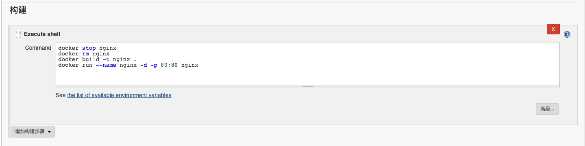

就是一个普通的执行代码

#### 构建后操作

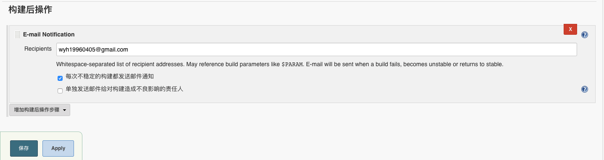

这里我选择 如果构建出现问题，发送邮件到我的邮箱

完了之后点击apply

此时可以手动点击构建也可以使用github变更构建